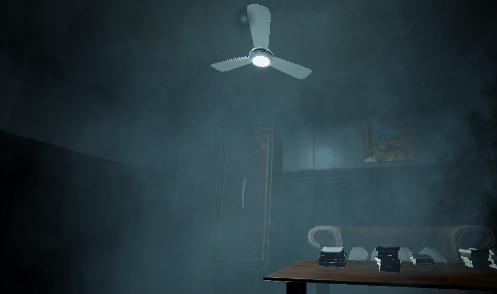
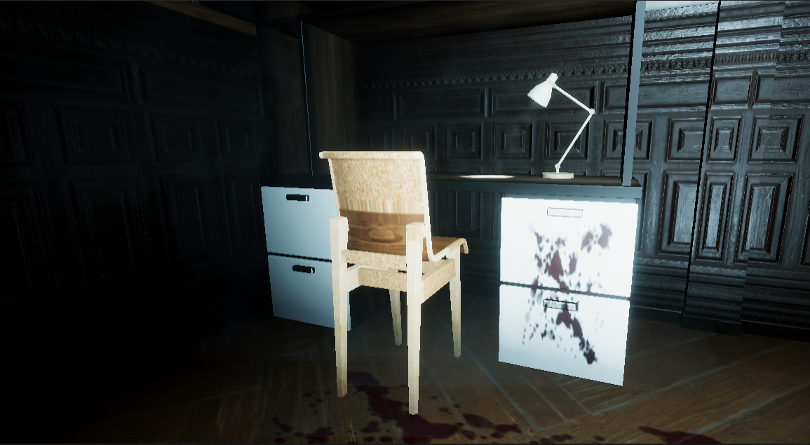
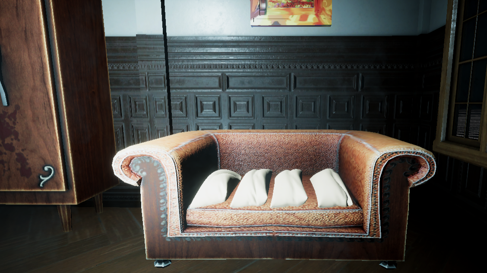
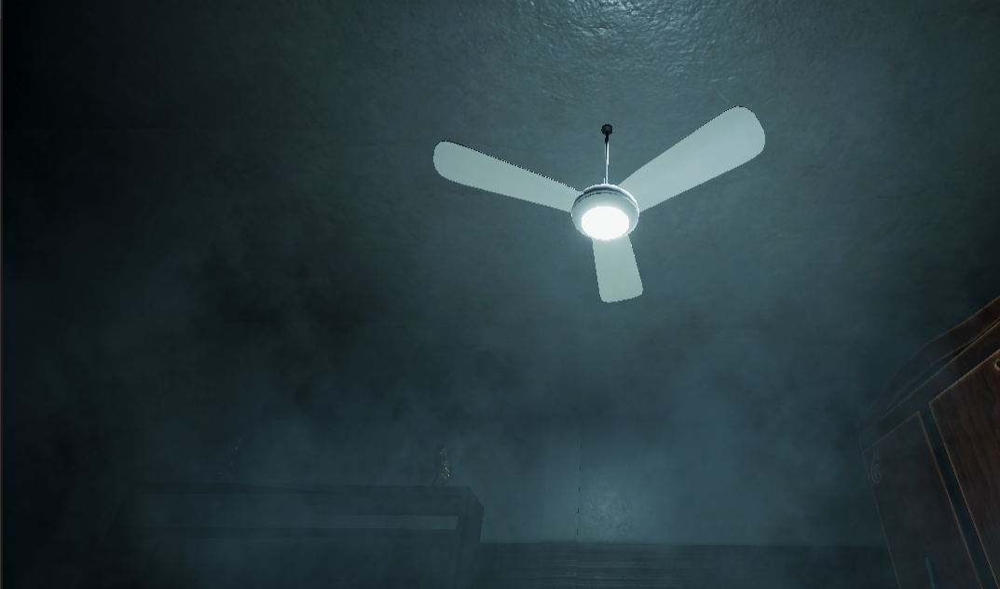

# github-portfolio
My personal portfolio
Welcome to my personal portfolio.

# My Personal Portfolio

Welcome to my personal portfolio.

## Unity HDRP Starter Office

This project is a nighttime office environment created in Unity 2019 HDRP as part of the Making Beautiful Games Course.

### Project Features

- HDRP lighting
- Interior lighting
- Volumetric lighting
- Fog and floating dust
- Reflection probe
- Light probes
- Emissive lighting
- Bloom
- Ambient occlusion
- Vignetting
- HDRP decals
- Light cookies
- Office furniture and decorations

### Final Scene

